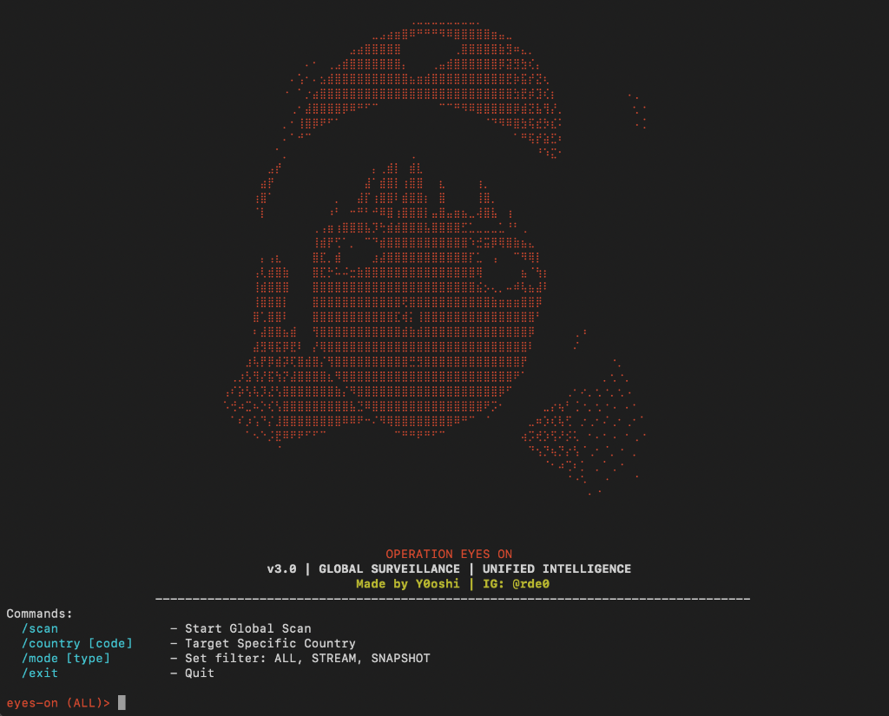

# Project Eyes On v3.0 (Global Surveillance)
**Coded by: Y0oshi (IG: @rde0)**

> "The unified intelligence tool for mass IP camera scanning."

  



## Overview
**Project Eyes On** is a hyper-fast, multi-threaded surveillance tool designed to locate open IP cameras across the globe. It combines two powerful engines:
1.  **Directory Scraper**: Harvests feeds from Insecam.
2.  **Deep Web Dorking**: Uses Google & Yahoo search dorks to find hidden cameras not listed in public directories.

## Features
-   **Unified Intelligence**: Access both scanning engines with a single `/scan` command.
-   **Anti-Blocking System**: automatically switches to **Yahoo Search** if Google blocks requests, ensuring zero downtime.
-   **Hyper-Speed**: Unlocked threads (100x workers) for instant parsing and verification.
-   **Zero-Wait**: Optimization algorithms remove artificial delays for maximum throughput.
-   **Country Targeting**: Target specific regions (e.g., `/country US`, `/country RU`).
-   **Stealth Mode**: Emulates real browser traffic to bypass firewalls.

## Installation

### Prerequisites
-   Python 3.x
-   Pip

### 🍎 macOS / 🐧 Linux
1. **Clone the Repository**:
```
git clone https://github.com/Y0oshi/Project-Eyes-On.git
cd Project-Eyes-On
```

2. **Install Global Command**:
The installer script sets up dependencies and creates the `eyeson` command.
```
chmod +x install.sh
sudo ./install.sh
```

3. **Run**:
```
sudo eyeson
```

### 🪟 Windows
1.  **Clone or Download**: Download the Repo ZIP and extract it.
2.  **Install Dependencies**:
    Open PowerShell or CMD in the folder:
    ```cmd
    pip install -r requirements.txt
    ```
3.  **Run**:
    ```cmd
    python eyes.py
    ```

## Usage

### Commands
| Command | Description | Example |
| :--- | :--- | :--- |
| `/scan [Pages]` | Start Global Scan (Default 3 pages) | `/scan 50` |
| `/country [Code]` | Target Logic (e.g., US, JP, RU) | `/country US` |
| `/mode [Type]` | Filter (ALL, STREAM, SNAPSHOT) | `/mode STREAM` |
| `/exit` | Quit Tool | `/exit` |

## Disclaimer
This tool is for **educational purposes and security auditing only**. The author (Y0oshi) is not responsible for any misuse of this software.

---
**Follow on Instagram: @rde0**
