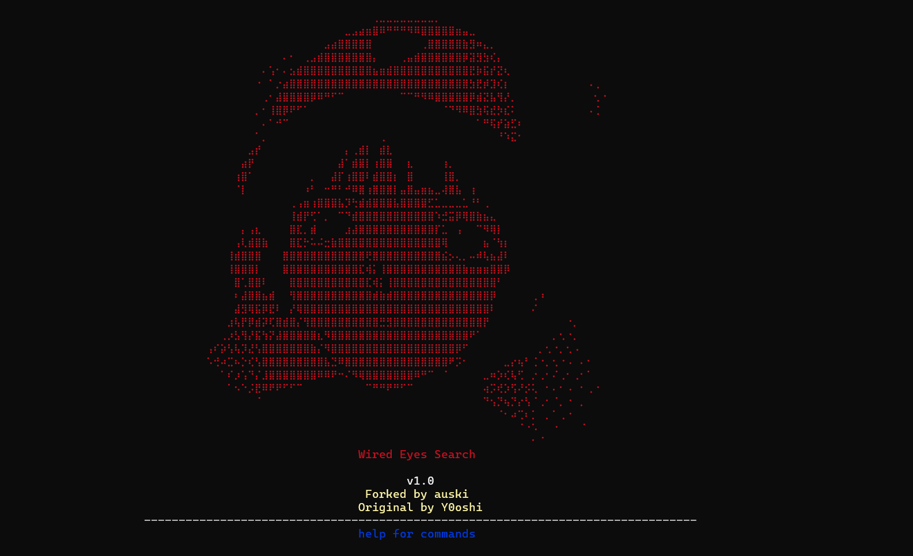

# Project Eyes On v4.0 (Global Surveillance)
**Coded by: Y0oshi (IG: @rde0)**

> "The unified intelligence tool for mass IP camera scanning."

  



## Overview
**Project Eyes On** is a multi-threaded reconnaissance tool designed to locate open IP cameras across the globe. It combines two engines:
1.  **Web Dorking**: Queries Yahoo, Bing, Mojeek and DuckDuckGo to find cameras not listed in public directories.
2.  **Directory Scraper**: Harvests feeds from Insecam.

## Features
-   **4 Search Engines**: Queries Yahoo, Bing, Mojeek and DuckDuckGo in parallel.
-   **Anti Rate-Limiting**: Per-engine pacing with automatic cooldowns keeps results flowing without proxies.
-   **Path Probing**: Finds streams hidden behind JavaScript web UIs by probing common camera paths.
-   **GeoIP Enrichment**: Resolves camera IPs to **City, Country** (e.g., "New York, United States").
-   **Smart Deduplication**: Merges engines and strips cache-buster params so each camera appears once.
-   **Live Verification**: Detects stream type (MJPEG, JPEG, Video).
-   **Country Targeting**: Focus a specific region by code (e.g., US, JP, RU).
-   **Interactive TUI**: Arrow-key menu — no slash commands.

## Installation

### Prerequisites
-   Python 3.x
-   Pip

### macOS / Linux
1. **Clone the Repository**:
```
git clone https://github.com/Y0oshi/Project-Eyes-On.git
cd Project-Eyes-On
```

2. **Install Global Command**:
The installer script sets up dependencies and creates the `eyeson` command.
```
chmod +x install.sh
sudo ./install.sh
```

3. **Run**:
```
sudo eyeson
```

### Windows
1. **Clone the Repository**:
```
git clone https://github.com/Y0oshi/Project-Eyes-On.git
cd Project-Eyes-On
```

2. **Automated Install**:
Just double-click `install.bat` or run:
```
install.bat
```

3. **Run**:
```
eyeson.bat
```

## Usage

### Interactive Mode
Run `eyeson` with no arguments to open the arrow-key menu:

-   **SCAN** — dork search. Set pages, dork count, random selection and mode.
-   **SCRAPE INSECAM** — directory scrape. Set pages, country and mode.
-   **OPTIONS** — JSON export path and which search engines to use.
-   **EXIT** — quit.

### Command Line
| Flag | Description | Example |
| :--- | :--- | :--- |
| `--scan N` | Dork search (N pages) | `--scan 50` |
| `--scrape N` | Scrape Insecam (N pages) | `--scrape 5` |
| `--unified N` | Run both engines (N pages) | `--unified 10` |
| `-c, --country CC` | Target country code | `--country US` |
| `-m, --mode M` | Filter: ALL / STREAM / SNAPSHOT | `--mode STREAM` |
| `-f, --format F` | Report format: json / csv / html | `--format csv` |
| `-o, --output DIR` | Output directory | `--output results` |
| `--no-verify` | List candidates without verifying | `--no-verify` |
| `--no-harvest` | Disable embedded-URL harvesting | `--no-harvest` |
| `--max-dorks N` | Cap dork count (0 = all) | `--max-dorks 100` |
| `--dorks FILE` | Custom dorks file (one per line) | `--dorks dorks.txt` |
| `--threads N` | Verification concurrency | `--threads 60` |
| `--timeout N` | Per-request timeout (seconds) | `--timeout 8` |
| `--list-countries` | List supported country codes | `--list-countries` |

## Disclaimer
This tool is for **educational purposes and security auditing only**. The author (Y0oshi) is not responsible for any misuse of this software.

> **Notice to Camera Owners**: If your device is found by this tool, it is **not the developer's fault**. It means your stream is public. **Don't be dumb put a password on your camera.**

---
**Follow on Instagram: @rde0**
